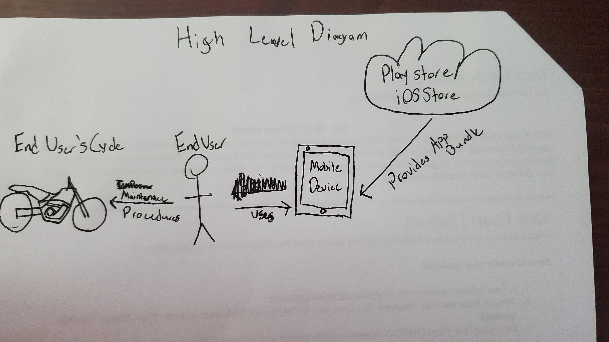
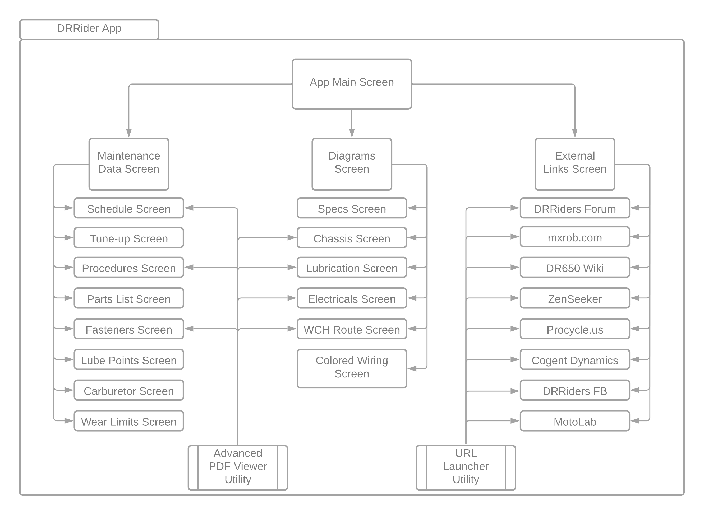
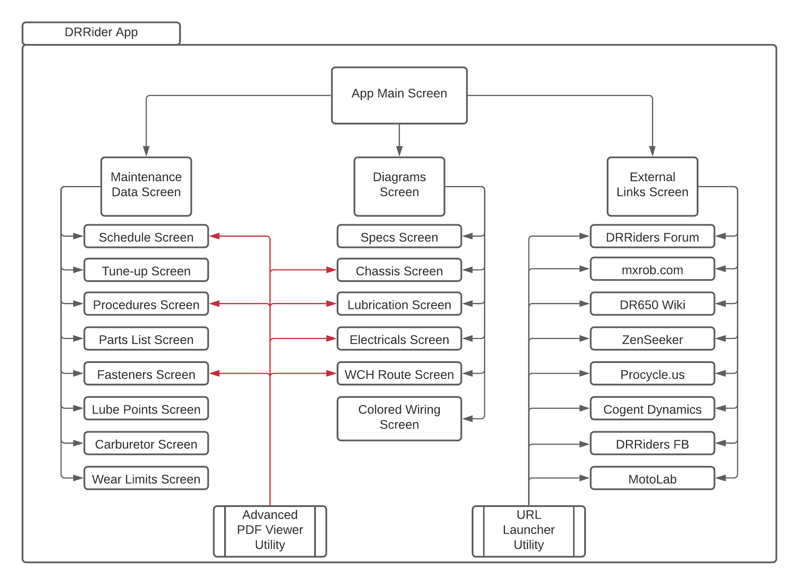

# Semester Project

DRRider

## Executive Summary

DRRider is an overhaul of mxrob's [MyDR650](https://play.google.com/store/apps/details?id=com.andromo.dev163023.app157444) application into a crossplatform format. The original app is beginning to show its age in its looks and lacks a clear layout making it a bit of a jumbled mess. The new DRRider app should contain all of the materials provided in the original app and present them in a visually appealing way that is not overly flashy. 

Given the [average age]( https://drriders.com/survey-how-old-are-you-t26111.html) and disposition of the owners that are going to be utilizing this app, materials should be clear and concise with just enough simplistic flair to get the point across. The predecessor of DRRider provided support to many garage nut and bolt twisters, so it would not do to pollute its legacy with an overly confusing update. Utilization of a similar theme to the [tapatalk forum]( https://drriders.com/) that it’s based on would most likely go across the best.

## Project Goals

- Transfer all data and materials in MyDR650 to DRRider
- Update MyDR650 materials with the v1.4 manual details
- Utilize a theme that mimics the tapatalk dark theme
- Create a more intuitive layout
- App must be fast and responsive just like its predecessor

## User Stories

As a **shadetree mechanic**, I want to be able to have **all critical materials on my device** so that when I **work in my garage with poor signal I am still able to open all critical screens**

*Criteria:*
- All screens (not including external links) should be viewable with or without connection
- Loss of connection should not interrupt or increase time for materials to display

As a **visually impaired user**, I want to be able to **pinch to zoom in and out on widgets** so that if I cannot quite read it **I intuitively know what gesture will help**

*Criteria:*
- All screens should support pinch to zoom

As a **thrifty user**, my device is several generations old. I want **to be able to run and store this app on my older device** so that I can **receive it’s benefits**

*Criteria:*
- App should be as small as possible using compressed files where possible

## Misuser Stories

As a **malicious actor** I want to **display unrelated documents when a pdf is loaded** so that **I can mislead the end user to do x bad thing**

- Document paths should be final
- Code and asset names should be obsfucated when building apb
- Assets should not be needlessly retrieved dynamically

I’m kind of reaching here. There are very few attack vectors for this app and those that do exist require root access beforehand to carry out. The external links are hardcoded, but those are supposed to be public so there is no vuln there.

## High Level Design

## Component List

From left to right

### End User’s Motorcycle

Specifically a 1996-Current Suzuki DR650. Without this the end user does not have the ability to turn his new-found knowledge into action.

### End User

The person who will be receiving knowledge from the application and applying it to his motorcycle. 

### Mobile Device

The device that the application will be installed to. Currently targeted at Android and iOS, Windows phone is still under investigation.

### Cloud Store

The store that the aab/apk can be downloaded from to the end user’s device. Currently available on the play store, apple store is a work in progress.

## App Design

## Security Analysis

As with the misuser stories, there are not very many vectors to be attacked here. 
I’m disregarding the cloud to device vector in the high level diagram. The bundles will be signed before being uploaded to the stores and both Google (I set it up) and Apple do signing on their service to get the bundle to the device.

| Component name | Category of vulnerability | Issue Description | Mitigation |
|----------------|---------------------------|-------------------|------------|
| Advanced PDF Viewer Utility | Not sure what to call this, maybe Asset Injection? | A evil user could overwrite an existing asset PDF and replace it with something else. Then when the pdfviewer is triggered during runtime with that asset path it will open the evil pdf. | **Accept the risk.** This one is so unrealistic and requires prior root access on the device to modify the asset file location. There is not much that could be done to protect the device in that case anyway. |

## Testing

There are not test cases for this project currently. Hold on! Don't start writing that 0/100 yet. 

In it's current state DRRider does not have something that I can test easily via test case. The stateful widgets are all using private methods and variables. These are not reachable from a unit test case so that is a bust. 

I attempted to widget test but the screens that I needed to test (the pdf viewer ones) are effectively useless because a failure case (when the progress indicate spins infinitely) is reached the findsWidgets will still return true since the widget does exsist and it is running even though it's waiting indefinitely for the document. From my short time working in app dev I've developed a burning hatred for test methods that aren't actually doing valid testing so I'm not going to serve up a directory full of- uh, *male cow excrement* if your following me, excuses for useless testcases.

On a positive note, with the way that I have the app setup currently each screen only relies on methods within their classes. All of the screens are independent of each other so while developing if the current screen is not working it will not break any of the other screens in a cascade effect. This is partly because the AdvancedPDFViewer utility that I am working with does not play well in a utility class and will not signal a reload once it's done loading. I had to bend a knee after hammering on it for four days and drop the utility idea.

So testing is currently as simple as checking that all of the items you need are appearing in the current screen. If the screens that you have made changes on are still functioning then the rest will be functioning still as well. Hopefully you can see that I did attempt to test it, unfortunately there isn't much that I can get hooks into with a test case that has actual meaning. 

## Packaging

**Android:** In Beta and downloadable from the playstore [here.](https://play.google.com/store/apps/details?id=net.thistleranch.drrider)

**iOS:** Work In Progress on iOS Test Flight. 

### Requirements

Very light on resources. Any device that has 26MB to spare will most likely be able to run this app.